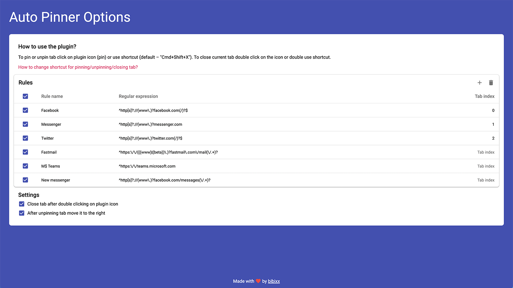

<div id="top"></div>

<!-- PROJECT SHIELDS -->
<div align="center">
  <a href="https://github.com/bibixx/tab-pinner/graphs/contributors">
    
  </a>
  <a href="https://github.com/bibixx/tab-pinner/network/members">
    
  </a>
  <a href="https://github.com/bibixx/tab-pinner/stargazers">
    
  </a>
  <a href="https://github.com/bibixx/tab-pinner/issues">
    
  </a>
  <a href="https://github.com/bibixx/tab-pinner/blob/master/LICENSE.md">
    
  </a>
  <a href="https://twitter.com/bibix1999/">
    
  </a>
</div>
<div align="center">
  <a href="https://semantic-release.gitbook.io/semantic-release/">
    
  </a>
  <a href="http://commitizen.github.io/cz-cli/">
    
  </a>
  <a href="https://www.conventionalcommits.org/en/v1.0.0/">
    
  </a>
</div>

<!-- PROJECT LOGO -->
<br />
<div align="center">
  <a href="https://github.com/bibixx/tab-pinner">
    
  </a>

<h3 align="center">Tab Pinner</h3>

  <p align="center">
    Chrome extension to easily pin and unpin tabs using a button and regular expressions.
    <br />
    <a href="https://chrome.google.com/webstore/detail/tab-pinner/mcclikmfcmcpejkaobpfkmmbekbhedoi"><strong>Check it out on Chrome Web Store »</strong></a>
    <br />
    <br />
    <a href="https://github.com/bibixx/tab-pinner/issues">Report Bug</a>
    ·
    <a href="https://github.com/bibixx/tab-pinner/issues">Request Feature</a>
  </p>
</div>


<!-- TABLE OF CONTENTS -->
<details>
  <summary>Table of Contents</summary>
  <ol>
    <li>
      <a href="#about-the-project">About The Project</a>
      <ul>
        <li><a href="#built-with">Built With</a></li>
      </ul>
    </li>
    <li><a href="#contributing">Contributing</a></li>
    <li>
      <a href="#development">Development</a>
      <ul>
        <li><a href="#prerequisites">Prerequisites</a></li>
        <li><a href="#installation">Installation</a></li>
      </ul>
    </li>
    <li><a href="#license">License</a></li>
    <li><a href="#contact">Contact</a></li>
  </ol>
</details>


<!-- ABOUT THE PROJECT -->
## About The Project

<div align="center">
  
</div>
<p align="center">
  Pin or unpin tab any tab easily using an extension icon in Chrome top bar or by using <a href="https://developer.mozilla.org/en-US/docs/Web/JavaScript/Guide/Regular_Expressions">JavaScript Regular Expressions</a>.
</p>


<p align="right">(<a href="#top">back to top</a>)</p>


### Built With

<a href="https://reactjs.org/">
  
</a>
<br />
<a href="https://www.typescriptlang.org/">
  
</a>
<br />
<a href="https://vitejs.dev/">
  
</a>
<br />
<a href="https://semantic-release.gitbook.io/semantic-release">
  
</a>
<br />

<p align="right">(<a href="#top">back to top</a>)</p>


<!-- CONTRIBUTING -->
## Contributing

Contributions are what make the open source community such an amazing place to learn, inspire, and create. Any contributions you make are **greatly appreciated**.

If you have a suggestion that would make this better, please fork the repo and create a pull request. You can also simply open an issue with the tag "enhancement".
Don't forget to give the project a star! Thanks again!

1. Fork the Project
2. Create your Feature Branch (`git checkout -b feature/AmazingFeature`)
3. Commit your Changes (`git commit -m 'feat: add some amazing feature'`)
    > Please note that we're following [Conventional Commits 1.0.0](https://www.conventionalcommits.org/en/v1.0.0/) specification which is being enforced with [commitlint](https://commitlint.js.org/).\
    > To use a commit creator run [`npx cz`](https://www.npmjs.com/package/commitizen) which will ensure that your commits are following the specs.
4. Push to the Branch (`git push origin feature/AmazingFeature`)
5. Open a Pull Request

<p align="right">(<a href="#top">back to top</a>)</p>


<!-- DEVELOPMENT -->
## Development
### Prerequisites

| Dependency | Version |
| ---------- | ------- |
| Node.js    | 16.0.0+ |

### Installation
1. Clone the repo
   ```sh
   git clone https://github.com/bibixx/tab-pinner.git
   ```
2. Install NPM packages
   ```sh
   npm install
   ```

3. Run `dev` command to start building the app to `build` directory
   ```bash
   npm run dev
   ```

4. Install the extension in Chrome
    1. Navigate to chrome://extensions
    2. Toggle into Developer Mode
    3. Click on "Load Unpacked Extension..."
    4. Select the `build` directory that has just been created after running `npm run dev`

### Other commands
| Command       | Behaviour |
| ------------- | --------------------------------------------------------------------------------------------------------------- |
| `dev:server`  | Runs HTTP server with hot reloading for the options page (completely disconnected from the installed extension) |
| `build`       | Builds the app in production mode into `build` directory                                                        |
| `type-check`  | Runs TypeScript check on the whole codebase                                                                     |
| `lint`        | Runs ESLint check on the whole codebase                                                                         |
| `lint-commit` | Runs commitlint on the latest commit                                                                            |

<p align="right">(<a href="#top">back to top</a>)</p>


<!-- LICENSE -->
## License

Distributed under the GNU General Public License License. See `LICENSE.md` for more information.

<p align="right">(<a href="#top">back to top</a>)</p>


<!-- CONTACT -->
## Contact

Bartosz Legięć: [@bibix1999](https://twitter.com/bibix1999)

Project Link: [https://github.com/bibixx/tab-pinner](https://github.com/bibixx/tab-pinner)

Chrome Web Store Link: [https://chrome.google.com/webstore/detail/tab-pinner/mcclikmfcmcpejkaobpfkmmbekbhedoi](https://chrome.google.com/webstore/detail/tab-pinner/mcclikmfcmcpejkaobpfkmmbekbhedoi)

<p align="right">(<a href="#top">back to top</a>)</p>
